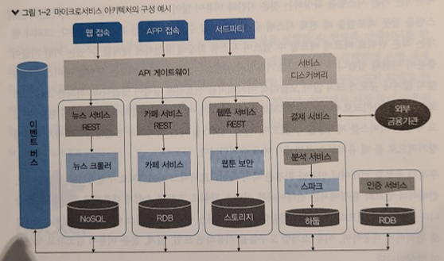
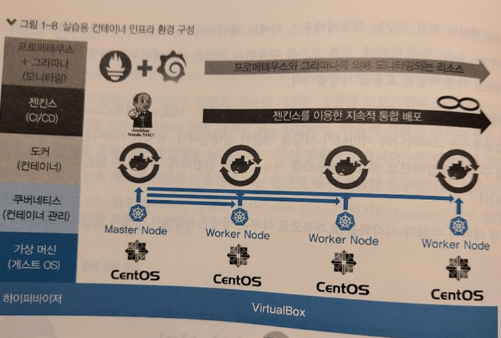
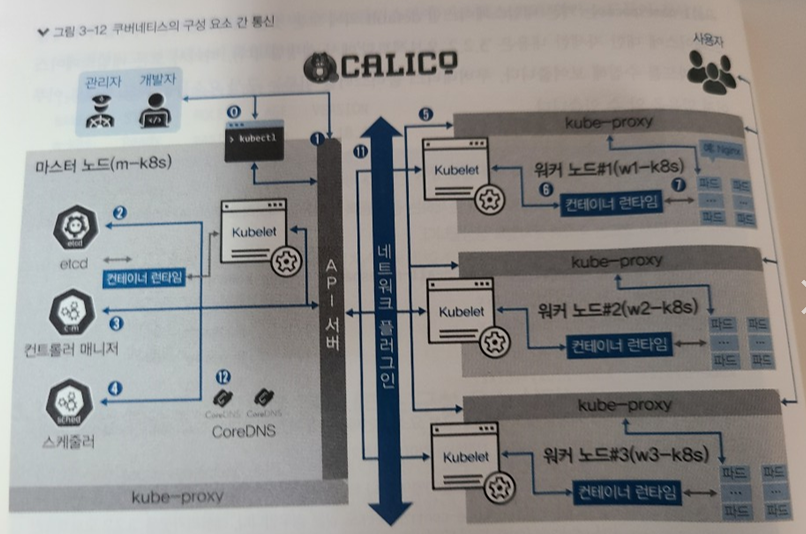

## Kubernetes 22.04.18~19


### 컨테이너 인프라 환경 구축을 위한 쿠버네티스 / 도커 책 참고


#### 쿠버네티스 기본 내용

* MSA 구조 예시

  


* 젠킨스, 쿠버네티스, 도커 를 활용한 CI/CD 구조




* 쿠버네티스의 구성 요소 및 통신

​	


* 마스터 노드
  * kubectl : 쿠버네티스 클러스터에 명령을 내리는 역할. 
  * API 서버 : 쿠버네티스 클러스터의 중심 역할을 하는 통로. 회사에 비유하면 모든 직원과 상황을 관리하고 목표를 설정하는 관리자에 해당
  * etcd : 구성 요소들의 상태 값이 모두 저장되는 곳. 복제해 여러 곳에 저장해 두면 복구가 가능.
  * 컨트롤러 매니저 : 쿠버네티스 클러스터의 오브젝트 상태를 관리. ex) 워커 노드에서 통신이 되지 않는 경우, 상태 체크와 복구는 컨트롤러 매니저에 속한 노드 컨트롤러에서 이루어짐. 레플리카셋 컨트롤러는 요청받은 파드 개수대로 파드 생성. 
  * 스케줄러 : 노드의 상태와 자원, 레이블, 요구 조건 등을 고려해 파드를 어떤 워커 노드에 생성할 것인지를 결정하고 할당합니다.
* 워커 노드
  * kubelet : 파드의 구성 내용을 받아서 컨테이너 런타임으로 전달하고, 파드 안의 컨테이너들이 정상적으로 작동하는지 모니터링.
  * 컨테이너 런타임(CRI) : 파드를 이루는 컨테이너으 ㅣ실행을 담당. 파드 안에서 다양한 종류의 컨테이너가 문제 없이 작동하게 만드는 표준 인터페이스.
  * 파드(Pod) : 한 개 이상의 컨테이너로 단일 목적의 일을 하기 위해서 모인 단위. 하지만, 언제라도 죽을 수 있는 존재


#### 쿠버네티스에서 직접 만든 컨테이너 적용

* jar 파일 빌드 후 도커 허브에 업로드

* 해당 이미지 pull 후 디플로이먼트 생성

  * ```bash
    kubectl apply -f ~~~.yml
    ```

* 디플로이먼트 정상적으로 작동하는지 확인

  * ```bash
    kubectl get pods -o wide
    ```

*  

  *  


#### 컨테이너 인프라 환경에서 Jenkins를 통한 CI/CD

* 젠킨스를 통해 컨테이너 빌드 & 푸시, 쿠버네티스 환경으로 배포가 자동화
* 동적인 변경 사항 빠르게 적용 도와주는 도구 `커스터마이즈`, `헬름`
* 배포 도구 
  * kubectl : 쿠버네티스 기본으로 포함된 커맨드라인 도구, 추가 설치 없이 바로 사용 가능. -> 정적인 yaml 파일
  * 커스터마이즈 : 오브젝트를 사용자의 의도에 따라 유동적으로 배포할 수 있음. -> 커스터마이즈 파일
  * 헬름 : 오브젝트 배포에 필요한 사양이 이미 정의된 차트라는 패키지 활용. 가변적인 인자 배포할때 다양한 배포 환경에 맞추거나 원하는 조건을 적용할 수 있으며, 오브젝트를 묶어 패키지 단위로 관리하므로 편리함. -> 패키지(차트)
* Jenkins
  * 아이템 : 젠킨스를 통해 빌드할 작업을 아이템이라고 함.


